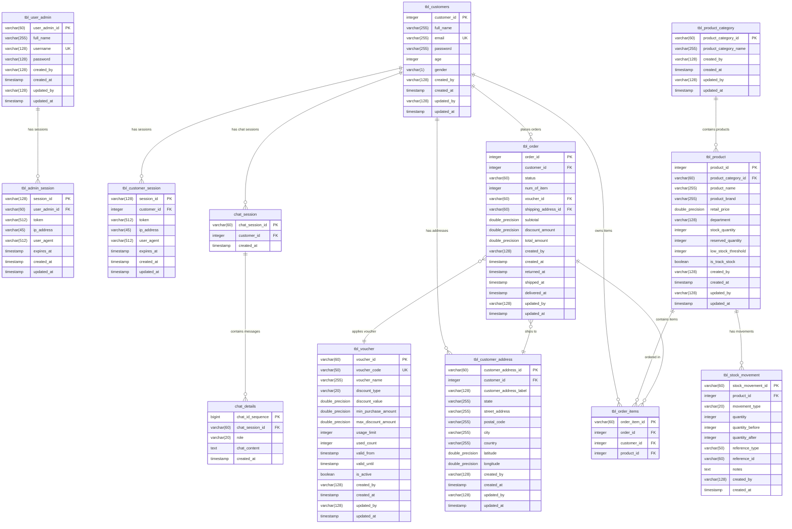

# E-Commerce API Documentation

A RESTful API for e-commerce operations built with FastAPI, providing customer authentication, product catalog browsing, shopping cart functionality, stock management, and an AI-powered shopping assistant.

---

## Table of Contents

1. [Overview](#overview)
2. [Base URL](#base-url)
3. [Authentication](#authentication)
   - [Authentication Flow](#authentication-flow)
   - [Token Format](#token-format)
   - [Token Expiration](#token-expiration)
4. [Response Format](#response-format)
   - [Success Response](#success-response)
   - [Error Response](#error-response)
5. [API Endpoints](#api-endpoints)
   - [Health Check](#health-check)
   - [Customer Authentication](#customer-authentication)
   - [Product Categories](#product-categories)
   - [Products](#products)
   - [Shopping Cart](#shopping-cart)
   - [Customer Addresses](#customer-addresses)
   - [Vouchers](#vouchers)
   - [Orders](#orders)
   - [Stock Management](#stock-management)
   - [AI Chatbot](#ai-chatbot)
6. [Error Codes](#error-codes)
7. [Data Models](#data-models)
8. [Database Schema](#database-schema)
   - [Entity Relationship Diagram (ERD)](#entity-relationship-diagram-erd)
   - [Data Dictionary](#data-dictionary)
9. [DDL Scripts](#ddl-scripts)
10. [Rate Limiting](#rate-limiting)
11. [Examples](#examples)
12. [Interactive Documentation](#interactive-documentation)
13. [Changelog](#changelog)

---

## Overview

This API provides the following capabilities:

- **Customer Authentication**: Secure JWT-based authentication for customers
- **Product Catalog**: Browse products and categories with filtering and pagination
- **Shopping Cart**: Add, remove, and manage cart items
- **Voucher System**: Apply discount codes with percentage or fixed discounts
- **Order Processing**: Checkout cart and track order status
- **Stock Management**: Track inventory levels, stock movements, and low stock alerts
- **AI Chatbot**: Natural language shopping assistant powered by Google Gemini

### Key Features

| Feature | Description |
|---------|-------------|
| JWT Authentication | Secure token-based authentication with session management |
| Paginated Responses | Efficient handling of large datasets |
| Product Filtering | Comprehensive filtering options (category, brand, price, department) |
| Voucher Support | Percentage and fixed discount coupons with validation |
| Order Management | Full order lifecycle tracking |
| Inventory Management | Real-time stock tracking with audit trail |
| Low Stock Alerts | Automatic monitoring and alerts for low inventory |
| AI Shopping Assistant | Natural language interface with tool calling capabilities |
| Chat Persistence | Session-based conversation history with token tracking |
| Product Images | Auto-generated via Picsum placeholder service |
| OpenAPI Documentation | Interactive Swagger UI at `/docs` |

---

## Base URL

```
http://localhost:8000/api/v1
```

All endpoints are prefixed with `/api/v1`.

---

## Authentication

### Authentication Flow

```
┌─────────────┐    1. POST /customer/auth/login    ┌─────────────┐
│   Client    │ ───────────────────────────────────▶│   Server    │
│             │◀─────────────────────────────────── │             │
└─────────────┘    2. Returns JWT Token             └─────────────┘
       │                                                   │
       │         3. Include token in header                │
       │         Authorization: Bearer <token>             │
       └───────────────────────────────────────────────────┘
```

1. Customer sends credentials to `/customer/auth/login`
2. Server validates credentials and returns a JWT token
3. Client includes the token in subsequent requests via the `Authorization` header
4. Server validates the token and session for each protected request

### Token Format

Include the JWT token in the `Authorization` header:

```http
Authorization: Bearer <access_token>
```

### Token Expiration

- Access tokens expire after **30 minutes** (configurable)
- Upon expiration, the customer must re-authenticate

---

## Response Format

All API responses follow a consistent JSON structure.

### Success Response

```json
{
  "status": "success",
  "status_code": 200,
  "message": "Operation completed successfully",
  "data": { ... }
}
```

| Field | Type | Description |
|-------|------|-------------|
| `status` | string | Always `"success"` for successful operations |
| `status_code` | integer | HTTP status code |
| `message` | string | Human-readable success message |
| `data` | object/array | Response payload (optional) |

### Error Response

```json
{
  "status": "error",
  "status_code": 400,
  "message": "Error description",
  "errors": { ... }
}
```

| Field | Type | Description |
|-------|------|-------------|
| `status` | string | Always `"error"` for failed operations |
| `status_code` | integer | HTTP status code |
| `message` | string | Human-readable error message |
| `errors` | object | Detailed error information (optional) |

---

## API Endpoints

### Health Check

#### Check API Health

```http
GET /health
```

Check if the API is running and healthy.

**Response** `200 OK`

```json
{
  "status": "success",
  "status_code": 200,
  "message": "Service is healthy",
  "data": {
    "app_name": "E-Commerce API",
    "version": "1.0.0"
  }
}
```

---

### Customer Authentication

#### Login

```http
POST /customer/auth/login
```

Authenticate a customer and obtain an access token.

**Request Body**

| Field | Type | Required | Description |
|-------|------|----------|-------------|
| `email` | string | Yes | Customer's email address |
| `password` | string | Yes | Customer's password |

**Example Request**

```json
{
  "email": "customer@example.com",
  "password": "yourpassword"
}
```

**Response** `200 OK`

```json
{
  "status": "success",
  "status_code": 200,
  "message": "Login successful",
  "data": {
    "access_token": "eyJhbGciOiJIUzI1NiIsInR5cCI6IkpXVCJ9...",
    "token_type": "bearer",
    "expires_at": "2024-01-31T12:30:00Z",
    "session_id": "550e8400-e29b-41d4-a716-446655440000"
  }
}
```

**Error Responses**

| Status | Description |
|--------|-------------|
| `401 Unauthorized` | Invalid email or password |
| `422 Unprocessable Entity` | Invalid request body |

---

#### Get Profile

```http
GET /customer/auth/me
```

Retrieve the authenticated customer's profile.

**Headers**

| Header | Value |
|--------|-------|
| `Authorization` | `Bearer <access_token>` |

**Response** `200 OK`

```json
{
  "status": "success",
  "status_code": 200,
  "message": "Profile retrieved successfully",
  "data": {
    "customer_id": 1,
    "full_name": "John Doe",
    "email": "customer@example.com",
    "age": 30,
    "gender": "M",
    "created_at": "2024-01-15T10:00:00Z"
  }
}
```

**Error Responses**

| Status | Description |
|--------|-------------|
| `401 Unauthorized` | Missing or invalid token |

---

#### Logout

```http
POST /customer/auth/logout
```

Invalidate the current session.

**Headers**

| Header | Value |
|--------|-------|
| `Authorization` | `Bearer <access_token>` |

**Response** `200 OK`

```json
{
  "status": "success",
  "status_code": 200,
  "message": "Successfully logged out",
  "data": {
    "session_id": "550e8400-e29b-41d4-a716-446655440000"
  }
}
```

---

### Product Categories

#### Get All Categories

```http
GET /categories
```

Retrieve all product categories.

**Response** `200 OK`

```json
{
  "status": "success",
  "status_code": 200,
  "message": "Categories retrieved successfully",
  "data": {
    "items": [
      {
        "product_category_id": "productcategory_20240131_abc123",
        "product_category_name": "Electronics",
        "created_at": "2024-01-31T10:00:00Z"
      },
      {
        "product_category_id": "productcategory_20240131_def456",
        "product_category_name": "Clothing",
        "created_at": "2024-01-31T10:00:00Z"
      }
    ],
    "total": 2
  }
}
```

---

#### Get Category by ID

```http
GET /categories/{category_id}
```

Retrieve a specific category by its ID.

**Path Parameters**

| Parameter | Type | Description |
|-----------|------|-------------|
| `category_id` | string | Category unique identifier |

**Response** `200 OK`

```json
{
  "status": "success",
  "status_code": 200,
  "message": "Category retrieved successfully",
  "data": {
    "product_category_id": "productcategory_20240131_abc123",
    "product_category_name": "Electronics",
    "created_at": "2024-01-31T10:00:00Z"
  }
}
```

**Error Responses**

| Status | Description |
|--------|-------------|
| `404 Not Found` | Category not found |

---

#### Get Products by Category

```http
GET /categories/{category_id}/products
```

Retrieve all products in a specific category.

**Path Parameters**

| Parameter | Type | Description |
|-----------|------|-------------|
| `category_id` | string | Category unique identifier |

**Query Parameters**

| Parameter | Type | Default | Description |
|-----------|------|---------|-------------|
| `page` | integer | 1 | Page number |
| `page_size` | integer | 10 | Items per page (max: 100) |

**Response** `200 OK`

```json
{
  "status": "success",
  "status_code": 200,
  "message": "Products retrieved successfully",
  "data": {
    "items": [
      {
        "product_id": 1,
        "product_category_id": "productcategory_20240131_abc123",
        "product_name": "Smartphone X",
        "product_brand": "TechBrand",
        "retail_price": 999.99,
        "department": "Men",
        "created_at": "2024-01-31T10:00:00Z"
      }
    ],
    "total": 50,
    "page": 1,
    "page_size": 10,
    "total_pages": 5
  }
}
```

**Error Responses**

| Status | Description |
|--------|-------------|
| `404 Not Found` | Category not found |

---

### Products

#### Get Products

```http
GET /products
```

Retrieve products with optional filtering and pagination.

**Query Parameters**

| Parameter | Type | Default | Description |
|-----------|------|---------|-------------|
| `category_id` | string | - | Filter by category ID |
| `brand` | string | - | Filter by brand name (partial match) |
| `department` | string | - | Filter by department (`Men` or `Women`) |
| `min_price` | number | - | Minimum price filter |
| `max_price` | number | - | Maximum price filter |
| `search` | string | - | Search by product name (partial match) |
| `page` | integer | 1 | Page number |
| `page_size` | integer | 10 | Items per page (max: 100) |

**Example Request**

```http
GET /products?department=Men&min_price=50&max_price=200&page=1&page_size=20
```

**Response** `200 OK`

```json
{
  "status": "success",
  "status_code": 200,
  "message": "Products retrieved successfully",
  "data": {
    "items": [
      {
        "product_id": 1,
        "product_category_id": "productcategory_20240131_abc123",
        "product_name": "Classic T-Shirt",
        "product_brand": "FashionBrand",
        "retail_price": 29.99,
        "department": "Men",
        "image_url": "https://picsum.photos/seed/1/200/200",
        "created_at": "2024-01-31T10:00:00Z"
      }
    ],
    "total": 150,
    "page": 1,
    "page_size": 20,
    "total_pages": 8
  }
}
```

---

#### Get Product by ID

```http
GET /products/{product_id}
```

Retrieve a specific product by its ID with category details.

**Path Parameters**

| Parameter | Type | Description |
|-----------|------|-------------|
| `product_id` | integer | Product unique identifier |

**Response** `200 OK`

```json
{
  "status": "success",
  "status_code": 200,
  "message": "Product retrieved successfully",
  "data": {
    "product_id": 1,
    "product_name": "Classic T-Shirt",
    "product_brand": "FashionBrand",
    "retail_price": 29.99,
    "department": "Men",
    "image_url": "https://picsum.photos/seed/1/200/200",
    "category": {
      "product_category_id": "productcategory_20240131_abc123",
      "product_category_name": "Clothing",
      "created_at": "2024-01-31T10:00:00Z"
    },
    "created_at": "2024-01-31T10:00:00Z"
  }
}
```

**Error Responses**

| Status | Description |
|--------|-------------|
| `404 Not Found` | Product not found |

---

#### Get All Brands

```http
GET /products/brands
```

Retrieve all unique product brands.

**Response** `200 OK`

```json
{
  "status": "success",
  "status_code": 200,
  "message": "Brands retrieved successfully",
  "data": {
    "brands": ["BrandA", "BrandB", "BrandC"],
    "total": 3
  }
}
```

---

#### Get All Departments

```http
GET /products/departments
```

Retrieve all unique product departments.

**Response** `200 OK`

```json
{
  "status": "success",
  "status_code": 200,
  "message": "Departments retrieved successfully",
  "data": {
    "departments": ["Men", "Women"],
    "total": 2
  }
}
```

---

### Shopping Cart

> **Note**: All shopping cart endpoints require authentication.

#### Get Cart

```http
GET /cart
```

Retrieve the current customer's shopping cart.

**Headers**

| Header | Value |
|--------|-------|
| `Authorization` | `Bearer <access_token>` |

**Response** `200 OK`

```json
{
  "status": "success",
  "status_code": 200,
  "message": "Cart retrieved successfully",
  "data": {
    "order_id": 1,
    "customer_id": 1,
    "status": "Cart",
    "items": [
      {
        "order_item_id": "orderitem_20240131_abc123",
        "product_id": 1,
        "product_name": "Classic T-Shirt",
        "product_brand": "FashionBrand",
        "retail_price": 29.99,
        "department": "Men"
      },
      {
        "order_item_id": "orderitem_20240131_def456",
        "product_id": 2,
        "product_name": "Casual Jeans",
        "product_brand": "DenimCo",
        "retail_price": 59.99,
        "department": "Men"
      }
    ],
    "num_of_item": 2,
    "total_price": 89.98,
    "created_at": "2024-01-31T10:00:00Z"
  }
}
```

---

#### Add to Cart

```http
POST /cart/items
```

Add a product to the shopping cart.

**Headers**

| Header | Value |
|--------|-------|
| `Authorization` | `Bearer <access_token>` |

**Request Body**

| Field | Type | Required | Description |
|-------|------|----------|-------------|
| `product_id` | integer | Yes | Product ID to add to cart |

**Example Request**

```json
{
  "product_id": 1
}
```

**Response** `201 Created`

```json
{
  "status": "success",
  "status_code": 201,
  "message": "Product added to cart successfully",
  "data": {
    "order_item_id": "orderitem_20240131_abc123",
    "order_id": 1,
    "product_id": 1,
    "message": "Product added to cart successfully"
  }
}
```

**Error Responses**

| Status | Description |
|--------|-------------|
| `401 Unauthorized` | Missing or invalid token |
| `404 Not Found` | Product not found |

---

#### Remove from Cart

```http
DELETE /cart/items/{order_item_id}
```

Remove a specific item from the cart.

**Headers**

| Header | Value |
|--------|-------|
| `Authorization` | `Bearer <access_token>` |

**Path Parameters**

| Parameter | Type | Description |
|-----------|------|-------------|
| `order_item_id` | string | Order item unique identifier |

**Response** `200 OK`

```json
{
  "status": "success",
  "status_code": 200,
  "message": "Product removed from cart successfully",
  "data": {
    "order_item_id": "orderitem_20240131_abc123",
    "message": "Product removed from cart successfully"
  }
}
```

**Error Responses**

| Status | Description |
|--------|-------------|
| `401 Unauthorized` | Missing or invalid token |
| `404 Not Found` | Cart item not found |

---

#### Clear Cart

```http
DELETE /cart
```

Remove all items from the shopping cart.

**Headers**

| Header | Value |
|--------|-------|
| `Authorization` | `Bearer <access_token>` |

**Response** `200 OK`

```json
{
  "status": "success",
  "status_code": 200,
  "message": "Cart cleared successfully",
  "data": {
    "order_id": 1,
    "items_removed": 5,
    "message": "Cart cleared successfully"
  }
}
```

**Error Responses**

| Status | Description |
|--------|-------------|
| `401 Unauthorized` | Missing or invalid token |
| `404 Not Found` | Cart not found |

---

#### Get Cart Item Count

```http
GET /cart/count
```

Get the number of items in the shopping cart.

**Headers**

| Header | Value |
|--------|-------|
| `Authorization` | `Bearer <access_token>` |

**Response** `200 OK`

```json
{
  "status": "success",
  "status_code": 200,
  "message": "Cart count retrieved successfully",
  "data": {
    "count": 5
  }
}
```

---

### Customer Addresses

> **Note**: All address endpoints require authentication.

#### Get Addresses

```http
GET /addresses
```

Retrieve all saved addresses for the authenticated customer.

**Headers**

| Header | Value |
|--------|-------|
| `Authorization` | `Bearer <access_token>` |

**Response** `200 OK`

```json
{
  "status": "success",
  "status_code": 200,
  "message": "Addresses retrieved successfully",
  "data": {
    "items": [
      {
        "customer_address_id": "customeraddress_20240131_abc123",
        "customer_id": 1,
        "customer_address_label": "Home",
        "street_address": "123 Main St",
        "city": "Jakarta",
        "state": "DKI Jakarta",
        "postal_code": "12345",
        "country": "Indonesia",
        "latitude": -6.2088,
        "longitude": 106.8456,
        "created_at": "2024-01-31T10:00:00Z"
      },
      {
        "customer_address_id": "customeraddress_20240131_def456",
        "customer_id": 1,
        "customer_address_label": "Office",
        "street_address": "456 Business Ave",
        "city": "Jakarta",
        "state": "DKI Jakarta",
        "postal_code": "12346",
        "country": "Indonesia",
        "latitude": -6.2100,
        "longitude": 106.8500,
        "created_at": "2024-01-31T11:00:00Z"
      }
    ],
    "total": 2
  }
}
```

**Error Responses**

| Status | Description |
|--------|-------------|
| `401 Unauthorized` | Missing or invalid token |

---

#### Get Address by ID

```http
GET /addresses/{address_id}
```

Retrieve a specific address by its ID.

**Headers**

| Header | Value |
|--------|-------|
| `Authorization` | `Bearer <access_token>` |

**Path Parameters**

| Parameter | Type | Description |
|-----------|------|-------------|
| `address_id` | string | Address unique identifier |

**Response** `200 OK`

```json
{
  "status": "success",
  "status_code": 200,
  "message": "Address retrieved successfully",
  "data": {
    "customer_address_id": "customeraddress_20240131_abc123",
    "customer_id": 1,
    "customer_address_label": "Home",
    "street_address": "123 Main St",
    "city": "Jakarta",
    "state": "DKI Jakarta",
    "postal_code": "12345",
    "country": "Indonesia",
    "latitude": -6.2088,
    "longitude": 106.8456,
    "created_at": "2024-01-31T10:00:00Z"
  }
}
```

**Error Responses**

| Status | Description |
|--------|-------------|
| `401 Unauthorized` | Missing or invalid token |
| `404 Not Found` | Address not found |

---

### Vouchers

#### Get Active Vouchers

```http
GET /orders/vouchers
```

Retrieve all active and valid vouchers. This endpoint does not require authentication.

**Response** `200 OK`

```json
{
  "status": "success",
  "status_code": 200,
  "message": "Vouchers retrieved successfully",
  "data": {
    "items": [
      {
        "voucher_id": "voucher_20240131_a1b2c3d4e5f6",
        "voucher_code": "DISCOUNT20",
        "voucher_name": "20% Off All Items",
        "discount_type": "percentage",
        "discount_value": 20.0,
        "min_purchase_amount": 50.0,
        "max_discount_amount": 100.0,
        "usage_limit": 1000,
        "used_count": 150,
        "valid_from": "2024-01-01T00:00:00Z",
        "valid_until": "2024-12-31T23:59:59Z"
      },
      {
        "voucher_id": "voucher_20240131_f6e5d4c3b2a1",
        "voucher_code": "FLAT25",
        "voucher_name": "$25 Off Your Order",
        "discount_type": "fixed",
        "discount_value": 25.0,
        "min_purchase_amount": 75.0,
        "max_discount_amount": null,
        "usage_limit": 500,
        "used_count": 45,
        "valid_from": "2024-01-01T00:00:00Z",
        "valid_until": "2024-12-31T23:59:59Z"
      }
    ],
    "total": 2
  }
}
```

**Notes:**

- Only returns vouchers where `is_active = true`
- Only returns vouchers within their validity period
- Only returns vouchers that haven't exceeded their usage limit

---

#### Apply Voucher

```http
POST /orders/cart/voucher
```

Apply a voucher/coupon code to the shopping cart.

**Headers**

| Header | Value |
|--------|-------|
| `Authorization` | `Bearer <access_token>` |

**Request Body**

| Field | Type | Required | Description |
|-------|------|----------|-------------|
| `voucher_code` | string | Yes | Voucher code to apply |

**Example Request**

```json
{
  "voucher_code": "DISCOUNT20"
}
```

**Response** `200 OK`

```json
{
  "status": "success",
  "status_code": 200,
  "message": "Voucher applied successfully",
  "data": {
    "voucher": {
      "voucher_id": "voucher_20240131_abc123",
      "voucher_code": "DISCOUNT20",
      "voucher_name": "20% Off All Items",
      "discount_type": "percentage",
      "discount_value": 20.0,
      "min_purchase_amount": 50.0,
      "max_discount_amount": 100.0,
      "valid_from": "2024-01-01T00:00:00Z",
      "valid_until": "2024-12-31T23:59:59Z"
    },
    "subtotal": 150.0,
    "discount_amount": 30.0,
    "total_amount": 120.0,
    "message": "Voucher applied successfully"
  }
}
```

**Error Responses**

| Status | Description |
|--------|-------------|
| `400 Bad Request` | Voucher invalid, expired, or minimum purchase not met |
| `401 Unauthorized` | Missing or invalid token |
| `404 Not Found` | Voucher or cart not found |

---

#### Remove Voucher

```http
DELETE /orders/cart/voucher
```

Remove the applied voucher from the shopping cart.

**Headers**

| Header | Value |
|--------|-------|
| `Authorization` | `Bearer <access_token>` |

**Response** `200 OK`

```json
{
  "status": "success",
  "status_code": 200,
  "message": "Voucher removed successfully",
  "data": {
    "subtotal": 150.0,
    "total_amount": 150.0,
    "message": "Voucher removed successfully"
  }
}
```

---

### Orders

> **Note**: All order endpoints require authentication.

#### Checkout

```http
POST /orders/checkout
```

Process checkout - convert cart to processing order.

**Headers**

| Header | Value |
|--------|-------|
| `Authorization` | `Bearer <access_token>` |

**Request Body**

| Field | Type | Required | Description |
|-------|------|----------|-------------|
| `shipping_address_id` | string | Yes | Customer's shipping address ID |
| `voucher_code` | string | No | Optional voucher code to apply |

**Example Request**

```json
{
  "shipping_address_id": "customeraddress_20240131_abc123",
  "voucher_code": "DISCOUNT20"
}
```

**Response** `201 Created`

```json
{
  "status": "success",
  "status_code": 201,
  "message": "Order placed successfully",
  "data": {
    "order": {
      "order_id": 1,
      "customer_id": 1,
      "status": "Processing",
      "num_of_item": 2,
      "subtotal": 150.0,
      "discount_amount": 30.0,
      "total_amount": 120.0,
      "voucher": {
        "voucher_id": "voucher_20240131_abc123",
        "voucher_code": "DISCOUNT20",
        "voucher_name": "20% Off",
        "discount_type": "percentage",
        "discount_value": 20.0
      },
      "shipping_address": {
        "customer_address_id": "customeraddress_20240131_abc123",
        "customer_address_label": "Home",
        "street_address": "123 Main St",
        "city": "Jakarta",
        "state": "DKI Jakarta",
        "postal_code": "12345",
        "country": "Indonesia"
      },
      "items": [
        {
          "order_item_id": "orderitem_20240131_abc123",
          "product_id": 1,
          "product_name": "Classic T-Shirt",
          "product_brand": "FashionBrand",
          "retail_price": 75.0,
          "department": "Men"
        }
      ],
      "created_at": "2024-01-31T10:00:00Z"
    },
    "message": "Order placed successfully"
  }
}
```

**Error Responses**

| Status | Description |
|--------|-------------|
| `400 Bad Request` | Cart is empty or voucher invalid |
| `401 Unauthorized` | Missing or invalid token |
| `404 Not Found` | Cart or shipping address not found |

---

#### Get Orders

```http
GET /orders
```

Retrieve customer's order history with optional filtering.

**Headers**

| Header | Value |
|--------|-------|
| `Authorization` | `Bearer <access_token>` |

**Query Parameters**

| Parameter | Type | Default | Description |
|-----------|------|---------|-------------|
| `status` | string | - | Filter by status (Processing, Shipped, Delivered, Complete, Cancelled, Returned) |
| `page` | integer | 1 | Page number |
| `page_size` | integer | 10 | Items per page (max: 100) |

**Example Request**

```http
GET /orders?status=Processing&page=1&page_size=10
```

**Response** `200 OK`

```json
{
  "status": "success",
  "status_code": 200,
  "message": "Orders retrieved successfully",
  "data": {
    "items": [
      {
        "order_id": 1,
        "customer_id": 1,
        "status": "Processing",
        "num_of_item": 2,
        "subtotal": 150.0,
        "discount_amount": 30.0,
        "total_amount": 120.0,
        "voucher": {
          "voucher_id": "voucher_20240131_abc123",
          "voucher_code": "DISCOUNT20"
        },
        "shipping_address": {
          "customer_address_id": "customeraddress_20240131_abc123",
          "customer_address_label": "Home",
          "city": "Jakarta"
        },
        "items": [...],
        "created_at": "2024-01-31T10:00:00Z"
      }
    ],
    "total": 5,
    "page": 1,
    "page_size": 10,
    "total_pages": 1
  }
}
```

---

#### Get Order by ID

```http
GET /orders/{order_id}
```

Retrieve a specific order by its ID.

**Headers**

| Header | Value |
|--------|-------|
| `Authorization` | `Bearer <access_token>` |

**Path Parameters**

| Parameter | Type | Description |
|-----------|------|-------------|
| `order_id` | integer | Order unique identifier |

**Response** `200 OK`

```json
{
  "status": "success",
  "status_code": 200,
  "message": "Order retrieved successfully",
  "data": {
    "order_id": 1,
    "customer_id": 1,
    "status": "Processing",
    "num_of_item": 2,
    "subtotal": 150.0,
    "discount_amount": 30.0,
    "total_amount": 120.0,
    "voucher": {
      "voucher_id": "voucher_20240131_abc123",
      "voucher_code": "DISCOUNT20",
      "voucher_name": "20% Off",
      "discount_type": "percentage",
      "discount_value": 20.0
    },
    "shipping_address": {
      "customer_address_id": "customeraddress_20240131_abc123",
      "customer_address_label": "Home",
      "street_address": "123 Main St",
      "city": "Jakarta",
      "state": "DKI Jakarta",
      "postal_code": "12345",
      "country": "Indonesia"
    },
    "items": [
      {
        "order_item_id": "orderitem_20240131_abc123",
        "product_id": 1,
        "product_name": "Classic T-Shirt",
        "retail_price": 75.0
      }
    ],
    "created_at": "2024-01-31T10:00:00Z",
    "shipped_at": null,
    "delivered_at": null
  }
}
```

**Error Responses**

| Status | Description |
|--------|-------------|
| `401 Unauthorized` | Missing or invalid token |
| `404 Not Found` | Order not found |

---

### Stock Management

Stock management endpoints allow administrators to track inventory levels, manage stock movements, and monitor low stock products.

#### Get Product Stock

```http
GET /stock/{product_id}
```

Retrieve stock information for a specific product. This endpoint is publicly accessible.

**Path Parameters**

| Parameter | Type | Description |
|-----------|------|-------------|
| `product_id` | integer | Product unique identifier |

**Response** `200 OK`

```json
{
  "status": "success",
  "status_code": 200,
  "message": "Stock information retrieved successfully",
  "data": {
    "product_id": 1,
    "product_name": "Classic T-Shirt",
    "stock_quantity": 100,
    "reserved_quantity": 5,
    "available_quantity": 95,
    "low_stock_threshold": 10,
    "is_track_stock": true,
    "stock_status": "IN_STOCK"
  }
}
```

**Stock Status Values**

| Status | Description |
|--------|-------------|
| `IN_STOCK` | Stock is above the low stock threshold |
| `LOW_STOCK` | Stock is at or below the low stock threshold |
| `OUT_OF_STOCK` | Stock quantity is zero |

**Error Responses**

| Status | Description |
|--------|-------------|
| `404 Not Found` | Product not found |

---

#### Get Low Stock Products

```http
GET /stock/low-stock
```

Retrieve all products with low or zero stock. Requires admin authentication.

**Headers**

| Header | Value |
|--------|-------|
| `Authorization` | `Bearer <admin_access_token>` |

**Response** `200 OK`

```json
{
  "status": "success",
  "status_code": 200,
  "message": "Low stock products retrieved successfully",
  "data": {
    "items": [
      {
        "product_id": 1,
        "product_name": "Classic T-Shirt",
        "product_brand": "FashionBrand",
        "product_category_name": "Clothing",
        "stock_quantity": 5,
        "reserved_quantity": 2,
        "available_quantity": 3,
        "low_stock_threshold": 10,
        "stock_status": "LOW_STOCK"
      },
      {
        "product_id": 2,
        "product_name": "Running Shoes",
        "product_brand": "SportsBrand",
        "product_category_name": "Footwear",
        "stock_quantity": 0,
        "reserved_quantity": 0,
        "available_quantity": 0,
        "low_stock_threshold": 5,
        "stock_status": "OUT_OF_STOCK"
      }
    ],
    "total": 2
  }
}
```

**Error Responses**

| Status | Description |
|--------|-------------|
| `401 Unauthorized` | Missing or invalid admin token |

---

#### Get Stock Movements

```http
GET /stock/{product_id}/movements
```

Retrieve stock movement history for a product. Requires admin authentication.

**Headers**

| Header | Value |
|--------|-------|
| `Authorization` | `Bearer <admin_access_token>` |

**Path Parameters**

| Parameter | Type | Description |
|-----------|------|-------------|
| `product_id` | integer | Product unique identifier |

**Query Parameters**

| Parameter | Type | Default | Description |
|-----------|------|---------|-------------|
| `movement_type` | string | - | Filter by movement type (IN, OUT, RESERVED, RELEASED, ADJUSTMENT) |
| `page` | integer | 1 | Page number |
| `page_size` | integer | 10 | Items per page (max: 100) |

**Response** `200 OK`

```json
{
  "status": "success",
  "status_code": 200,
  "message": "Stock movements retrieved successfully",
  "data": {
    "items": [
      {
        "stock_movement_id": "stockmov_20240131_abc123",
        "product_id": 1,
        "movement_type": "IN",
        "quantity": 50,
        "quantity_before": 50,
        "quantity_after": 100,
        "reference_type": "MANUAL",
        "reference_id": null,
        "notes": "Restocking from supplier",
        "created_by": "admin",
        "created_at": "2024-01-31T10:00:00Z"
      },
      {
        "stock_movement_id": "stockmov_20240131_def456",
        "product_id": 1,
        "movement_type": "OUT",
        "quantity": 5,
        "quantity_before": 100,
        "quantity_after": 95,
        "reference_type": "ORDER",
        "reference_id": "123",
        "notes": null,
        "created_by": "system",
        "created_at": "2024-01-31T11:00:00Z"
      }
    ],
    "total": 2,
    "page": 1,
    "page_size": 10,
    "total_pages": 1
  }
}
```

**Movement Types**

| Type | Description |
|------|-------------|
| `IN` | Stock added (replenishment, returns) |
| `OUT` | Stock removed (sold, shipped) |
| `RESERVED` | Stock reserved for pending order |
| `RELEASED` | Stock released from cancelled order |
| `ADJUSTMENT` | Manual inventory adjustment |

**Error Responses**

| Status | Description |
|--------|-------------|
| `401 Unauthorized` | Missing or invalid admin token |
| `404 Not Found` | Product not found |

---

#### Add Stock

```http
POST /stock/{product_id}/add
```

Add stock to a product (stock in). Requires admin authentication.

**Headers**

| Header | Value |
|--------|-------|
| `Authorization` | `Bearer <admin_access_token>` |

**Path Parameters**

| Parameter | Type | Description |
|-----------|------|-------------|
| `product_id` | integer | Product unique identifier |

**Request Body**

| Field | Type | Required | Description |
|-------|------|----------|-------------|
| `quantity` | integer | Yes | Quantity to add (must be positive) |
| `notes` | string | No | Optional notes for the operation |

**Example Request**

```json
{
  "quantity": 50,
  "notes": "Restocking from supplier ABC"
}
```

**Response** `201 Created`

```json
{
  "status": "success",
  "status_code": 201,
  "message": "Stock added successfully",
  "data": {
    "product_id": 1,
    "movement_id": "stockmov_20240131_abc123",
    "movement_type": "IN",
    "quantity_changed": 50,
    "previous_stock": 50,
    "current_stock": 100,
    "message": "Stock added successfully"
  }
}
```

**Error Responses**

| Status | Description |
|--------|-------------|
| `400 Bad Request` | Invalid quantity (must be positive) |
| `401 Unauthorized` | Missing or invalid admin token |
| `404 Not Found` | Product not found |

---

#### Remove Stock

```http
POST /stock/{product_id}/remove
```

Remove stock from a product (stock out). Requires admin authentication.

**Headers**

| Header | Value |
|--------|-------|
| `Authorization` | `Bearer <admin_access_token>` |

**Path Parameters**

| Parameter | Type | Description |
|-----------|------|-------------|
| `product_id` | integer | Product unique identifier |

**Request Body**

| Field | Type | Required | Description |
|-------|------|----------|-------------|
| `quantity` | integer | Yes | Quantity to remove (must be positive) |
| `notes` | string | No | Optional notes for the operation |

**Example Request**

```json
{
  "quantity": 10,
  "notes": "Damaged goods removal"
}
```

**Response** `200 OK`

```json
{
  "status": "success",
  "status_code": 200,
  "message": "Stock removed successfully",
  "data": {
    "product_id": 1,
    "movement_id": "stockmov_20240131_abc123",
    "movement_type": "OUT",
    "quantity_changed": 10,
    "previous_stock": 100,
    "current_stock": 90,
    "message": "Stock removed successfully"
  }
}
```

**Error Responses**

| Status | Description |
|--------|-------------|
| `400 Bad Request` | Insufficient stock or invalid quantity |
| `401 Unauthorized` | Missing or invalid admin token |
| `404 Not Found` | Product not found |

---

#### Adjust Stock

```http
POST /stock/{product_id}/adjust
```

Adjust stock to a specific quantity. Requires admin authentication.

**Headers**

| Header | Value |
|--------|-------|
| `Authorization` | `Bearer <admin_access_token>` |

**Path Parameters**

| Parameter | Type | Description |
|-----------|------|-------------|
| `product_id` | integer | Product unique identifier |

**Request Body**

| Field | Type | Required | Description |
|-------|------|----------|-------------|
| `new_quantity` | integer | Yes | New stock quantity (must be non-negative) |
| `notes` | string | No | Reason for adjustment |

**Example Request**

```json
{
  "new_quantity": 75,
  "notes": "Inventory count adjustment"
}
```

**Response** `200 OK`

```json
{
  "status": "success",
  "status_code": 200,
  "message": "Stock adjusted successfully",
  "data": {
    "product_id": 1,
    "movement_id": "stockmov_20240131_abc123",
    "movement_type": "ADJUSTMENT",
    "quantity_changed": 25,
    "previous_stock": 100,
    "current_stock": 75,
    "message": "Stock adjusted successfully"
  }
}
```

**Error Responses**

| Status | Description |
|--------|-------------|
| `400 Bad Request` | Invalid quantity (must be non-negative) |
| `401 Unauthorized` | Missing or invalid admin token |
| `404 Not Found` | Product not found |

---

#### Update Stock Settings

```http
PATCH /stock/{product_id}/settings
```

Update stock tracking settings for a product. Requires admin authentication.

**Headers**

| Header | Value |
|--------|-------|
| `Authorization` | `Bearer <admin_access_token>` |

**Path Parameters**

| Parameter | Type | Description |
|-----------|------|-------------|
| `product_id` | integer | Product unique identifier |

**Request Body**

| Field | Type | Required | Description |
|-------|------|----------|-------------|
| `low_stock_threshold` | integer | No | New low stock alert threshold |
| `is_track_stock` | boolean | No | Enable/disable stock tracking |

**Example Request**

```json
{
  "low_stock_threshold": 15,
  "is_track_stock": true
}
```

**Response** `200 OK`

```json
{
  "status": "success",
  "status_code": 200,
  "message": "Stock settings updated successfully",
  "data": {
    "product_id": 1,
    "product_name": "Classic T-Shirt",
    "stock_quantity": 75,
    "reserved_quantity": 5,
    "available_quantity": 70,
    "low_stock_threshold": 15,
    "is_track_stock": true,
    "stock_status": "IN_STOCK"
  }
}
```

**Error Responses**

| Status | Description |
|--------|-------------|
| `401 Unauthorized` | Missing or invalid admin token |
| `404 Not Found` | Product not found |

---

### AI Chatbot

AI-powered shopping assistant that helps customers find products, manage cart, and complete checkout using natural language. Powered by Google Gemini.

#### Send Message

```http
POST /chatbot/chat
```

Send a message to the AI chatbot and receive a response. The chatbot can search products, add to cart, apply vouchers, and guide checkout.

**Headers**

| Header | Value |
|--------|-------|
| `Authorization` | `Bearer <access_token>` (optional) |

**Request Body**

| Field | Type | Required | Description |
|-------|------|----------|-------------|
| `message` | string | Yes | User message to the chatbot |
| `session_id` | string | No | Existing session ID to continue conversation |

**Example Request**

```json
{
  "message": "Show me jackets under $100",
  "session_id": "chatsession_20260201_abc123def456"
}
```

**Response** `200 OK`

```json
{
  "status": "success",
  "status_code": 200,
  "message": "Message processed successfully",
  "data": {
    "session_id": "chatsession_20260201_abc123def456",
    "response": "I found some great jackets under $100! Here are my top recommendations...",
    "tool_calls": [
      {
        "tool": "search_products",
        "arguments": {"search": "jacket", "max_price": 100},
        "result": {"success": true, "data": {...}}
      }
    ],
    "products": [
      {
        "product_id": 12345,
        "product_name": "Classic Denim Jacket",
        "product_brand": "Levi's",
        "retail_price": 89.99,
        "department": "Men",
        "image_url": "https://picsum.photos/seed/12345/200/200"
      }
    ],
    "token_usage": {
      "prompt_tokens": 150,
      "completion_tokens": 200,
      "total_tokens": 350
    },
    "created_at": "2026-02-01T10:00:00Z"
  }
}
```

**Response Fields**

| Field | Type | Description |
|-------|------|-------------|
| `session_id` | string | Chat session ID for continuing conversation |
| `response` | string | AI-generated response text |
| `tool_calls` | array | List of tools executed by the AI (optional) |
| `products` | array | Product data for frontend display (optional) |
| `token_usage` | object | Token usage statistics |
| `created_at` | datetime | Response timestamp |

**Product Object Fields**

| Field | Type | Description |
|-------|------|-------------|
| `product_id` | integer | Product unique identifier |
| `product_name` | string | Product name |
| `product_brand` | string | Brand name |
| `retail_price` | number | Price |
| `department` | string | Department (Men/Women) |
| `image_url` | string | Product image URL (Picsum placeholder) |

**Token Usage Object**

| Field | Type | Description |
|-------|------|-------------|
| `prompt_tokens` | integer | Tokens used in prompt |
| `completion_tokens` | integer | Tokens in AI response |
| `total_tokens` | integer | Total tokens consumed |

**Chatbot Capabilities**

| Capability | Example Prompts |
|------------|-----------------|
| Product Search | "Show me red dresses", "Find Nike shoes" |
| Find Product by Name | "Find the Elwood Clothing Connley Cardigan", "Show me the Classic T-Shirt" |
| Price Filtering | "Jackets under $100", "Bags between $50 and $200" |
| Gift Suggestions | "Gift ideas for my girlfriend", "Birthday present for dad" |
| Product Comparison | "Compare product 123 and 456" |
| Stock Check by ID | "Is product 789 in stock?" |
| Stock Check by Name | "Is the Connley Cardigan in stock?", "Check stock for Nike Air Max" |
| Cart Management | "Add this to my cart", "Show my cart", "Remove item" |
| Voucher Help | "What discounts are available?", "Apply code DISCOUNT20" |
| Address by Label | "Send to my home", "Use my office address", "Ship to home" |
| Checkout | "I want to checkout", "Help me complete my order" |

**Notes:**

- Authentication is optional but required for cart/checkout operations
- Session ID persists conversation context
- Product images use Picsum placeholder (consistent per product_id)

---

#### Create Chat Session

```http
POST /chatbot/chat/sessions
```

Create a new chat session manually. Sessions are also created automatically when sending the first message.

**Headers**

| Header | Value |
|--------|-------|
| `Authorization` | `Bearer <access_token>` (optional) |

**Response** `201 Created`

```json
{
  "status": "success",
  "status_code": 201,
  "message": "Chat session created successfully",
  "data": {
    "session_id": "chatsession_20260201_abc123def456",
    "customer_id": 12345,
    "created_at": "2026-02-01T10:00:00Z"
  }
}
```

**Response Fields**

| Field | Type | Description |
|-------|------|-------------|
| `session_id` | string | Unique session ID (format: `chatsession_yyyymmdd_md5hash`) |
| `customer_id` | integer | Customer ID from token (null if not authenticated) |
| `created_at` | datetime | Session creation timestamp |

---

#### Get Customer Sessions

```http
GET /chatbot/chat/sessions
```

Retrieve all chat sessions for the authenticated customer. Requires authentication.

**Headers**

| Header | Value |
|--------|-------|
| `Authorization` | `Bearer <access_token>` (required) |

**Query Parameters**

| Parameter | Type | Default | Description |
|-----------|------|---------|-------------|
| `limit` | integer | 10 | Maximum number of sessions to return |

**Response** `200 OK`

```json
{
  "status": "success",
  "status_code": 200,
  "message": "Chat sessions retrieved successfully",
  "data": {
    "sessions": [
      {
        "session_id": "chatsession_20260201_abc123def456",
        "customer_id": 12345,
        "created_at": "2026-02-01T10:00:00Z"
      },
      {
        "session_id": "chatsession_20260131_xyz789ghi012",
        "customer_id": 12345,
        "created_at": "2026-01-31T15:30:00Z"
      }
    ],
    "total": 2
  }
}
```

**Response Fields**

| Field | Type | Description |
|-------|------|-------------|
| `sessions` | array | List of customer's chat sessions |
| `sessions[].session_id` | string | Unique session ID |
| `sessions[].customer_id` | integer | Customer ID |
| `sessions[].created_at` | datetime | Session creation timestamp |
| `total` | integer | Total number of sessions returned |

**Error Responses**

| Status | Description |
|--------|-------------|
| `401 Unauthorized` | Authentication required |

**Notes:**

- Sessions are ordered by creation date (most recent first)
- Only sessions belonging to the authenticated customer are returned

---

#### Get Session History

```http
GET /chatbot/chat/sessions/{session_id}
```

Retrieve the full conversation history for a chat session.

**Path Parameters**

| Parameter | Type | Description |
|-----------|------|-------------|
| `session_id` | string | Chat session ID |

**Response** `200 OK`

```json
{
  "status": "success",
  "status_code": 200,
  "message": "Session history retrieved successfully",
  "data": {
    "session_id": "chatsession_20260201_abc123def456",
    "customer_id": 12345,
    "created_at": "2026-02-01T10:00:00Z",
    "messages": [
      {
        "role": "user",
        "content": "Show me jackets",
        "token_usage": null,
        "created_at": "2026-02-01T10:00:00Z"
      },
      {
        "role": "model",
        "content": "Here are some great jacket options...",
        "token_usage": {
          "prompt_tokens": 100,
          "completion_tokens": 150,
          "total_tokens": 250
        },
        "created_at": "2026-02-01T10:00:05Z"
      }
    ]
  }
}
```

**Message Object Fields**

| Field | Type | Description |
|-------|------|-------------|
| `role` | string | Message role: `user` or `model` |
| `content` | string | Message content |
| `token_usage` | object | Token usage (only for model responses) |
| `created_at` | datetime | Message timestamp |

**Error Responses**

| Status | Description |
|--------|-------------|
| `404 Not Found` | Session not found |

---

#### Delete Chat Session

```http
DELETE /chatbot/chat/sessions/{session_id}
```

Delete a chat session and all its associated messages permanently.

**Path Parameters**

| Parameter | Type | Description |
|-----------|------|-------------|
| `session_id` | string | Chat session ID to delete |

**Headers**

| Header | Value |
|--------|-------|
| `Authorization` | `Bearer <access_token>` (optional) |

**Response** `200 OK`

```json
{
  "status": "success",
  "status_code": 200,
  "message": "Chat session deleted successfully",
  "data": {
    "session_id": "chatsession_20260201_abc123def456"
  }
}
```

**Response Fields**

| Field | Type | Description |
|-------|------|-------------|
| `session_id` | string | The deleted session ID |

**Error Responses**

| Status | Description |
|--------|-------------|
| `403 Forbidden` | User is not authorized to delete this session |
| `404 Not Found` | Session not found |

**Notes:**

- If authenticated, only sessions belonging to the authenticated customer can be deleted
- Guest sessions (sessions with no customer_id) can be deleted without authentication
- Deleting a session permanently removes all associated messages
- This action cannot be undone

---

## Error Codes

### HTTP Status Codes

| HTTP Code | Error | Description |
|-----------|-------|-------------|
| `400` | Bad Request | Invalid request syntax or parameters |
| `401` | Unauthorized | Authentication required or token invalid |
| `403` | Forbidden | Access denied to the requested resource |
| `404` | Not Found | Requested resource not found |
| `422` | Unprocessable Entity | Validation error in request body |
| `500` | Internal Server Error | Unexpected server error |

### Custom Error Types

| Error | HTTP Code | Description |
|-------|-----------|-------------|
| `InvalidCredentialsError` | 401 | Invalid email or password |
| `SessionExpiredError` | 401 | Session has expired |
| `SessionNotFoundError` | 401 | Session not found or invalid |
| `ProductNotFoundError` | 404 | Product does not exist |
| `CategoryNotFoundError` | 404 | Category does not exist |
| `CartItemNotFoundError` | 404 | Cart item does not exist |
| `CartNotFoundError` | 404 | Cart does not exist |
| `VoucherNotFoundError` | 404 | Voucher code does not exist |
| `VoucherInvalidError` | 400 | Voucher is invalid or expired |
| `VoucherMinPurchaseError` | 400 | Cart total doesn't meet minimum purchase |
| `VoucherUsageLimitError` | 400 | Voucher usage limit reached |
| `AddressNotFoundError` | 404 | Shipping address does not exist |
| `CartEmptyError` | 400 | Cannot checkout an empty cart |
| `OrderNotFoundError` | 404 | Order does not exist |
| `InsufficientStockError` | 400 | Not enough stock available |
| `StockMovementNotFoundError` | 404 | Stock movement does not exist |
| `InvalidStockOperationError` | 400 | Invalid stock operation (e.g., negative quantity) |

---

## Data Models

### Customer

| Field | Type | Description |
|-------|------|-------------|
| `customer_id` | integer | Unique identifier |
| `full_name` | string | Customer's full name |
| `email` | string | Email address (unique) |
| `age` | integer | Customer's age |
| `gender` | string | Gender (M/F) |
| `created_at` | datetime | Account creation timestamp |

### Product Category

| Field | Type | Description |
|-------|------|-------------|
| `product_category_id` | string | Unique identifier (format: `productcategory_yyyymmdd_md5hash`) |
| `product_category_name` | string | Category name |
| `created_at` | datetime | Creation timestamp |

### Product

| Field | Type | Description |
|-------|------|-------------|
| `product_id` | integer | Unique identifier |
| `product_category_id` | string | Category reference |
| `product_name` | string | Product name |
| `product_brand` | string | Brand name |
| `retail_price` | number | Price in currency units |
| `department` | string | Department (Men/Women) |
| `image_url` | string | Product image URL (auto-generated via Picsum) |
| `stock_quantity` | integer | Current total stock quantity |
| `reserved_quantity` | integer | Stock reserved by pending orders |
| `low_stock_threshold` | integer | Threshold for low stock alerts |
| `is_track_stock` | boolean | Whether stock is tracked for this product |
| `created_at` | datetime | Creation timestamp |

> **Note:** The `image_url` field is auto-generated using Picsum placeholder service with the format: `https://picsum.photos/seed/{product_id}/200/200`. Each product always gets the same image based on its ID.

### Stock Movement

| Field | Type | Description |
|-------|------|-------------|
| `stock_movement_id` | string | Unique identifier (format: `stockmov_yyyymmdd_md5hash`) |
| `product_id` | integer | Product reference |
| `movement_type` | string | Type: IN, OUT, RESERVED, RELEASED, ADJUSTMENT |
| `quantity` | integer | Quantity moved (always positive) |
| `quantity_before` | integer | Stock before movement |
| `quantity_after` | integer | Stock after movement |
| `reference_type` | string | Source type: ORDER, MANUAL, IMPORT, RETURN |
| `reference_id` | string | Reference identifier (order_id, etc.) |
| `notes` | string | Additional notes |
| `created_by` | string | User who created the movement |
| `created_at` | datetime | Movement timestamp |

### Order

| Field | Type | Description |
|-------|------|-------------|
| `order_id` | integer | Unique identifier |
| `customer_id` | integer | Customer reference |
| `status` | string | Order status (`Cart`, `Processing`, `Shipped`, `Delivered`, `Complete`, `Cancelled`, `Returned`) |
| `num_of_item` | integer | Number of items |
| `voucher_id` | string | Applied voucher reference |
| `shipping_address_id` | string | Shipping address reference |
| `subtotal` | number | Subtotal before discount |
| `discount_amount` | number | Discount amount |
| `total_amount` | number | Total after discount |
| `created_at` | datetime | Creation timestamp |
| `shipped_at` | datetime | Shipped timestamp |
| `delivered_at` | datetime | Delivered timestamp |

### Order Item

| Field | Type | Description |
|-------|------|-------------|
| `order_item_id` | string | Unique identifier (format: `orderitem_yyyymmdd_md5hash`) |
| `order_id` | integer | Order reference |
| `customer_id` | integer | Customer reference |
| `product_id` | integer | Product reference |

### Voucher

| Field | Type | Description |
|-------|------|-------------|
| `voucher_id` | string | Unique identifier (format: `voucher_yyyymmdd_md5hash`) |
| `voucher_code` | string | Voucher code (unique) |
| `voucher_name` | string | Voucher name/description |
| `discount_type` | string | Discount type (`percentage` or `fixed`) |
| `discount_value` | number | Discount value (percentage 0-100 or fixed amount) |
| `min_purchase_amount` | number | Minimum purchase amount to use voucher |
| `max_discount_amount` | number | Maximum discount for percentage type |
| `usage_limit` | integer | Maximum number of uses allowed |
| `used_count` | integer | Current usage count |
| `valid_from` | datetime | Voucher validity start date |
| `valid_until` | datetime | Voucher validity end date |
| `is_active` | boolean | Whether voucher is active |

### Customer Address

| Field | Type | Description |
|-------|------|-------------|
| `customer_address_id` | string | Unique identifier (format: `customeraddress_yyyymmdd_md5hash`) |
| `customer_id` | integer | Customer reference |
| `customer_address_label` | string | Address label (Home, Office, etc) |
| `street_address` | string | Street address |
| `city` | string | City |
| `state` | string | State/Province |
| `postal_code` | string | Postal/ZIP code |
| `country` | string | Country |
| `latitude` | number | Latitude coordinate |
| `longitude` | number | Longitude coordinate |

### Chat Session

| Field | Type | Description |
|-------|------|-------------|
| `chat_session_id` | string | Unique identifier (format: `chatsession_yyyymmdd_md5hash`) |
| `customer_id` | integer | Customer reference (nullable if guest) |
| `created_at` | datetime | Session creation timestamp |

### Chat Details (Messages)

| Field | Type | Description |
|-------|------|-------------|
| `chat_id_sequence` | integer | Auto-increment primary key |
| `chat_session_id` | string | Session reference |
| `role` | string | Message role: `user` or `model` |
| `chat_content` | text | Message content |
| `token_usage` | jsonb | Token usage stats (for model responses) |
| `created_at` | datetime | Message timestamp |

### Token Usage (JSON)

| Field | Type | Description |
|-------|------|-------------|
| `prompt_tokens` | integer | Tokens in the prompt |
| `completion_tokens` | integer | Tokens in the completion |
| `total_tokens` | integer | Total tokens used |

---

## Database Schema

This section provides a comprehensive view of the database structure, including entity relationships and detailed data dictionary for each table.

### Entity Relationship Diagram (ERD)

The following diagram illustrates the relationships between all database tables in the e-commerce system.



### Data Dictionary

The following tables provide detailed information about each database table, including field names, data types, constraints, and descriptions.

---

#### Table: `tbl_user_admin`

**Description:** Stores administrative user accounts for the e-commerce system.

| Field Name | Data Type | Constraints | Description |
|------------|-----------|-------------|-------------|
| `user_admin_id` | VARCHAR(60) | PK | Primary key - unique identifier for admin users |
| `full_name` | VARCHAR(255) | - | Full name of the administrator |
| `username` | VARCHAR(128) | UNIQUE | Unique username for login |
| `password` | VARCHAR(128) | - | Encrypted password |
| `created_by` | VARCHAR(128) | - | Username of the creator |
| `created_at` | TIMESTAMP | - | Record creation timestamp |
| `updated_by` | VARCHAR(128) | - | Username of last updater |
| `updated_at` | TIMESTAMP | - | Last update timestamp |

**Indexes:**
- `tbl_user_admin_username_idx` - Unique index on `username`

---

#### Table: `tbl_customers`

**Description:** Stores customer account information.

| Field Name | Data Type | Constraints | Description |
|------------|-----------|-------------|-------------|
| `customer_id` | INTEGER | PK | Primary key - unique identifier for customers |
| `full_name` | VARCHAR(255) | - | Customer's full name |
| `email` | VARCHAR(255) | UNIQUE | Customer's email address (unique) |
| `password` | VARCHAR(255) | - | Bcrypt encrypted password |
| `age` | INTEGER | - | Customer's age |
| `gender` | VARCHAR(1) | - | Gender: 'M' for male, 'F' for female |
| `created_by` | VARCHAR(128) | - | Username of the creator |
| `created_at` | TIMESTAMP | - | Record creation timestamp |
| `updated_by` | VARCHAR(128) | - | Username of last updater |
| `updated_at` | TIMESTAMP | - | Last update timestamp |

**Indexes:**
- `tbl_customers_email_idx` - Unique index on `email`

---

#### Table: `tbl_customer_address`

**Description:** Stores customer shipping and billing addresses.

| Field Name | Data Type | Constraints | Description |
|------------|-----------|-------------|-------------|
| `customer_address_id` | VARCHAR(60) | PK | Primary key - Format: `customeraddress_yyyymmdd_md5hash` |
| `customer_id` | INTEGER | FK | Foreign key referencing `tbl_customers` |
| `customer_address_label` | VARCHAR(128) | - | Address label (e.g., "Home", "Office") |
| `state` | VARCHAR(255) | - | State or province |
| `street_address` | VARCHAR(255) | - | Street address |
| `postal_code` | VARCHAR(255) | - | Postal/ZIP code |
| `city` | VARCHAR(255) | - | City name |
| `country` | VARCHAR(255) | - | Country name |
| `latitude` | DOUBLE PRECISION | - | Geographic latitude coordinate |
| `longitude` | DOUBLE PRECISION | - | Geographic longitude coordinate |
| `created_by` | VARCHAR(128) | - | Username of the creator |
| `created_at` | TIMESTAMP | - | Record creation timestamp |
| `updated_by` | VARCHAR(128) | - | Username of last updater |
| `updated_at` | TIMESTAMP | - | Last update timestamp |

**Indexes:**
- `tbl_customer_address_customer_id_idx` - Index on `customer_id`

---

#### Table: `tbl_product_category`

**Description:** Stores product category definitions. Format for ID: `productcategory_yyyymmdd_md5hash`

| Field Name | Data Type | Constraints | Description |
|------------|-----------|-------------|-------------|
| `product_category_id` | VARCHAR(60) | PK | Primary key - Format: `productcategory_yyyymmdd_md5hash` |
| `product_category_name` | VARCHAR(255) | - | Name of the product category |
| `created_by` | VARCHAR(128) | - | Username of the creator |
| `created_at` | TIMESTAMP | - | Record creation timestamp |
| `updated_by` | VARCHAR(128) | - | Username of last updater |
| `updated_at` | TIMESTAMP | - | Last update timestamp |

---

#### Table: `tbl_product`

**Description:** Stores product information including inventory data.

| Field Name | Data Type | Constraints | Description |
|------------|-----------|-------------|-------------|
| `product_id` | INTEGER | PK | Primary key - unique identifier for products |
| `product_category_id` | VARCHAR(60) | FK | Foreign key referencing `tbl_product_category` |
| `product_name` | VARCHAR(255) | - | Name of the product |
| `product_brand` | VARCHAR(255) | - | Brand name |
| `retail_price` | DOUBLE PRECISION | - | Retail price of the product |
| `department` | VARCHAR(128) | - | Department: 'Men' or 'Women' |
| `stock_quantity` | INTEGER | DEFAULT 0, CHECK >= 0 | Current available stock quantity |
| `reserved_quantity` | INTEGER | DEFAULT 0, CHECK >= 0 | Quantity reserved by pending orders (status: Cart, Processing) |
| `low_stock_threshold` | INTEGER | DEFAULT 10, CHECK >= 0 | Threshold for low stock alert notification |
| `is_track_stock` | BOOLEAN | DEFAULT TRUE | Whether to track stock for this product |
| `created_by` | VARCHAR(128) | - | Username of the creator |
| `created_at` | TIMESTAMP | - | Record creation timestamp |
| `updated_by` | VARCHAR(128) | - | Username of last updater |
| `updated_at` | TIMESTAMP | - | Last update timestamp |

**Constraints:**
- `chk_stock_quantity_non_negative` - CHECK (stock_quantity >= 0)
- `chk_reserved_quantity_non_negative` - CHECK (reserved_quantity >= 0)
- `chk_low_stock_threshold_positive` - CHECK (low_stock_threshold >= 0)
- `chk_reserved_not_exceed_stock` - CHECK (reserved_quantity <= stock_quantity)

**Indexes:**
- `tbl_product_category_id_idx` - Index on `product_category_id`
- `tbl_product_department_idx` - Index on `department`
- `tbl_product_brand_idx` - Index on `product_brand`
- `tbl_product_stock_idx` - Index on `stock_quantity`
- `tbl_product_low_stock_idx` - Partial index on `(stock_quantity, low_stock_threshold)` WHERE `is_track_stock = true`

---

#### Table: `tbl_customer_session`

**Description:** Stores customer authentication sessions.

| Field Name | Data Type | Constraints | Description |
|------------|-----------|-------------|-------------|
| `session_id` | VARCHAR(128) | PK | Primary key - unique session identifier |
| `customer_id` | INTEGER | FK, NOT NULL | Foreign key referencing `tbl_customers` (CASCADE on DELETE) |
| `token` | VARCHAR(512) | NOT NULL | JWT authentication token |
| `ip_address` | VARCHAR(45) | - | Client IP address |
| `user_agent` | VARCHAR(512) | - | Client user agent string |
| `expires_at` | TIMESTAMP | NOT NULL | Session expiration timestamp |
| `created_at` | TIMESTAMP | - | Session creation timestamp |
| `updated_at` | TIMESTAMP | - | Last update timestamp |

**Indexes:**
- `tbl_customer_session_token_idx` - Index on `token`
- `tbl_customer_session_expires_idx` - Index on `expires_at`

---

#### Table: `tbl_admin_session`

**Description:** Stores administrator authentication sessions.

| Field Name | Data Type | Constraints | Description |
|------------|-----------|-------------|-------------|
| `session_id` | VARCHAR(128) | PK | Primary key - unique session identifier |
| `user_admin_id` | VARCHAR(60) | FK, NOT NULL | Foreign key referencing `tbl_user_admin` (CASCADE on DELETE) |
| `token` | VARCHAR(512) | NOT NULL | JWT authentication token |
| `ip_address` | VARCHAR(45) | - | Client IP address |
| `user_agent` | VARCHAR(512) | - | Client user agent string |
| `expires_at` | TIMESTAMP | NOT NULL | Session expiration timestamp |
| `created_at` | TIMESTAMP | - | Session creation timestamp |
| `updated_at` | TIMESTAMP | - | Last update timestamp |

**Indexes:**
- `tbl_admin_session_token_idx` - Index on `token`
- `tbl_admin_session_expires_idx` - Index on `expires_at`

---

#### Table: `tbl_voucher`

**Description:** Stores discount voucher/coupon definitions.

| Field Name | Data Type | Constraints | Description |
|------------|-----------|-------------|-------------|
| `voucher_id` | VARCHAR(60) | PK | Primary key - unique voucher identifier |
| `voucher_code` | VARCHAR(50) | NOT NULL, UNIQUE | Unique voucher code for redemption |
| `voucher_name` | VARCHAR(255) | - | Display name/description of voucher |
| `discount_type` | VARCHAR(20) | NOT NULL | Type: 'percentage' or 'fixed' |
| `discount_value` | DOUBLE PRECISION | NOT NULL | Discount value (percentage 0-100 or fixed amount) |
| `min_purchase_amount` | DOUBLE PRECISION | DEFAULT 0 | Minimum cart value to use voucher |
| `max_discount_amount` | DOUBLE PRECISION | - | Maximum discount cap (for percentage type) |
| `usage_limit` | INTEGER | - | Maximum number of redemptions allowed |
| `used_count` | INTEGER | DEFAULT 0 | Current number of times used |
| `valid_from` | TIMESTAMP | - | Voucher validity start date |
| `valid_until` | TIMESTAMP | - | Voucher validity end date |
| `is_active` | BOOLEAN | DEFAULT TRUE | Whether voucher is currently active |
| `created_by` | VARCHAR(128) | - | Username of the creator |
| `created_at` | TIMESTAMP | - | Record creation timestamp |
| `updated_by` | VARCHAR(128) | - | Username of last updater |
| `updated_at` | TIMESTAMP | - | Last update timestamp |

**Indexes:**
- `tbl_voucher_code_idx` - Unique index on `voucher_code`
- `tbl_voucher_valid_idx` - Index on `(valid_from, valid_until)`
- `tbl_voucher_active_idx` - Index on `is_active`

---

#### Table: `tbl_order`

**Description:** Stores order header information.

| Field Name | Data Type | Constraints | Description |
|------------|-----------|-------------|-------------|
| `order_id` | INTEGER | PK | Primary key - unique order identifier |
| `customer_id` | INTEGER | FK | Foreign key referencing `tbl_customers` |
| `status` | VARCHAR(60) | - | Order status: Cart, Cancelled, Complete, Processing, Returned, Shipped |
| `num_of_item` | INTEGER | - | Number of items in the order |
| `voucher_id` | VARCHAR(60) | FK | Foreign key referencing `tbl_voucher` |
| `shipping_address_id` | VARCHAR(60) | FK | Foreign key referencing `tbl_customer_address` |
| `subtotal` | DOUBLE PRECISION | - | Order subtotal before discount |
| `discount_amount` | DOUBLE PRECISION | DEFAULT 0 | Discount amount applied |
| `total_amount` | DOUBLE PRECISION | - | Final total after discount |
| `created_by` | VARCHAR(128) | - | Username of the creator |
| `created_at` | TIMESTAMP | - | Order creation timestamp |
| `returned_at` | TIMESTAMP | - | Order return timestamp |
| `shipped_at` | TIMESTAMP | - | Order shipping timestamp |
| `delivered_at` | TIMESTAMP | - | Order delivery timestamp |
| `updated_by` | VARCHAR(128) | - | Username of last updater |
| `updated_at` | TIMESTAMP | - | Last update timestamp |

**Indexes:**
- `tbl_order_customer_id_idx` - Index on `customer_id`
- `tbl_order_status_idx` - Index on `status`
- `tbl_order_created_at_idx` - Index on `created_at`
- `tbl_order_status_created_idx` - Composite index on `(status, created_at)`
- `tbl_order_voucher_id_idx` - Index on `voucher_id`

---

#### Table: `tbl_order_items`

**Description:** Stores individual items within orders.

| Field Name | Data Type | Constraints | Description |
|------------|-----------|-------------|-------------|
| `order_item_id` | VARCHAR(60) | PK | Primary key - Format: `orderitem_yyyymmdd_md5hash` |
| `order_id` | INTEGER | FK | Foreign key referencing `tbl_order` |
| `customer_id` | INTEGER | FK | Foreign key referencing `tbl_customers` |
| `product_id` | INTEGER | FK | Foreign key referencing `tbl_product` |

**Indexes:**
- `tbl_order_items_order_id_idx` - Index on `order_id`
- `tbl_order_items_customer_id_idx` - Index on `customer_id`
- `tbl_order_items_product_id_idx` - Index on `product_id`

---

#### Table: `tbl_stock_movement`

**Description:** Stock movement history for audit trail.

| Field Name | Data Type | Constraints | Description |
|------------|-----------|-------------|-------------|
| `stock_movement_id` | VARCHAR(60) | PK | Primary key - Format: `stockmov_yyyymmdd_md5hash` |
| `product_id` | INTEGER | FK, NOT NULL | Foreign key referencing `tbl_product` |
| `movement_type` | VARCHAR(20) | NOT NULL, CHECK | Movement type: IN, OUT, RESERVED, RELEASED, ADJUSTMENT |
| `quantity` | INTEGER | NOT NULL, CHECK > 0 | Quantity of movement (always positive) |
| `quantity_before` | INTEGER | NOT NULL | Stock quantity before movement |
| `quantity_after` | INTEGER | NOT NULL, CHECK >= 0 | Stock quantity after movement |
| `reference_type` | VARCHAR(50) | - | Reference source type: ORDER, MANUAL, IMPORT, RETURN |
| `reference_id` | VARCHAR(60) | - | Reference ID (order_id, import batch, etc.) |
| `notes` | TEXT | - | Additional notes about the movement |
| `created_by` | VARCHAR(128) | - | Username of the creator |
| `created_at` | TIMESTAMP | DEFAULT CURRENT_TIMESTAMP | Movement timestamp |

**Constraints:**
- `chk_movement_type` - CHECK (movement_type IN ('IN', 'OUT', 'RESERVED', 'RELEASED', 'ADJUSTMENT'))
- `chk_quantity_positive` - CHECK (quantity > 0)
- `chk_quantity_after_non_negative` - CHECK (quantity_after >= 0)

**Indexes:**
- `tbl_stock_movement_product_id_idx` - Index on `product_id`
- `tbl_stock_movement_type_idx` - Index on `movement_type`
- `tbl_stock_movement_created_at_idx` - Index on `created_at`
- `tbl_stock_movement_reference_idx` - Composite index on `(reference_type, reference_id)`

**Movement Type Definitions:**

| Type | Description |
|------|-------------|
| `IN` | Stock added (replenishment, returns) |
| `OUT` | Stock removed (sold, shipped) |
| `RESERVED` | Stock reserved for pending order |
| `RELEASED` | Stock released from cancelled order |
| `ADJUSTMENT` | Manual inventory adjustment |

---

#### Table: `chat_session`

**Description:** Stores AI chatbot conversation sessions.

| Field Name | Data Type | Constraints | Description |
|------------|-----------|-------------|-------------|
| `chat_session_id` | VARCHAR(60) | PK | Primary key - Format: `chatsession_yyyymmdd_md5hash` |
| `customer_id` | INTEGER | FK | Foreign key referencing `tbl_customers` (nullable for guest sessions) |
| `created_at` | TIMESTAMP | - | Session creation timestamp |

---

#### Table: `chat_details`

**Description:** Stores individual chat messages within sessions.

| Field Name | Data Type | Constraints | Description |
|------------|-----------|-------------|-------------|
| `chat_id_sequence` | BIGINT | PK, AUTO INCREMENT | Primary key - auto-incrementing sequence |
| `chat_session_id` | VARCHAR(60) | FK | Foreign key referencing `chat_session` |
| `role` | VARCHAR(20) | - | Message role: 'model' or 'user' |
| `chat_content` | TEXT | - | The message content |
| `created_at` | TIMESTAMP | - | Message timestamp |

---

#### View: `vw_low_stock_products`

**Description:** View to monitor products with low or zero stock.

| Field Name | Data Type | Description |
|------------|-----------|-------------|
| `product_id` | INTEGER | Product identifier |
| `product_name` | VARCHAR(255) | Product name |
| `product_brand` | VARCHAR(255) | Brand name |
| `product_category_name` | VARCHAR(255) | Category name |
| `stock_quantity` | INTEGER | Current stock quantity |
| `reserved_quantity` | INTEGER | Reserved quantity |
| `available_quantity` | INTEGER | Calculated: stock_quantity - reserved_quantity |
| `low_stock_threshold` | INTEGER | Low stock alert threshold |
| `stock_status` | TEXT | Status: 'OUT_OF_STOCK', 'LOW_STOCK', or 'IN_STOCK' |

**Filter Conditions:**
- Only includes products where `is_track_stock = TRUE`
- Only includes products where `stock_quantity <= low_stock_threshold`

---

## DDL Scripts

### Voucher Table

```sql
CREATE TABLE tbl_voucher (
    voucher_id VARCHAR(60) NOT NULL
        CONSTRAINT tbl_voucher_pk PRIMARY KEY,
    voucher_code VARCHAR(50) NOT NULL,
    voucher_name VARCHAR(255),
    discount_type VARCHAR(20) NOT NULL,
    discount_value DOUBLE PRECISION NOT NULL,
    min_purchase_amount DOUBLE PRECISION DEFAULT 0,
    max_discount_amount DOUBLE PRECISION,
    usage_limit INTEGER,
    used_count INTEGER DEFAULT 0,
    valid_from TIMESTAMP,
    valid_until TIMESTAMP,
    is_active BOOLEAN DEFAULT true,
    created_by VARCHAR(128),
    created_at TIMESTAMP,
    updated_by VARCHAR(128),
    updated_at TIMESTAMP
);

COMMENT ON TABLE tbl_voucher IS 'Format voucher_id: voucher_yyyymmdd_md5hash';
COMMENT ON COLUMN tbl_voucher.discount_type IS 'Values: percentage, fixed';
COMMENT ON COLUMN tbl_voucher.discount_value IS 'Percentage (0-100) or fixed amount';

ALTER TABLE tbl_voucher OWNER TO postgres;

CREATE UNIQUE INDEX tbl_voucher_code_idx ON tbl_voucher (voucher_code);
CREATE INDEX tbl_voucher_valid_idx ON tbl_voucher (valid_from, valid_until);
CREATE INDEX tbl_voucher_active_idx ON tbl_voucher (is_active);
```

### Order Table Additions

```sql
ALTER TABLE tbl_order
    ADD COLUMN voucher_id VARCHAR(60)
        CONSTRAINT tbl_order_tbl_voucher_voucher_id_fk
            REFERENCES tbl_voucher,
    ADD COLUMN shipping_address_id VARCHAR(60)
        CONSTRAINT tbl_order_tbl_customer_address_customer_address_id_fk
            REFERENCES tbl_customer_address,
    ADD COLUMN subtotal DOUBLE PRECISION,
    ADD COLUMN discount_amount DOUBLE PRECISION DEFAULT 0,
    ADD COLUMN total_amount DOUBLE PRECISION;

CREATE INDEX tbl_order_voucher_id_idx ON tbl_order (voucher_id);
```

### Product Table Stock Additions

```sql
-- Add stock management columns to tbl_product
ALTER TABLE tbl_product
    ADD COLUMN stock_quantity INTEGER DEFAULT 0,
    ADD COLUMN reserved_quantity INTEGER DEFAULT 0,
    ADD COLUMN low_stock_threshold INTEGER DEFAULT 10,
    ADD COLUMN is_track_stock BOOLEAN DEFAULT TRUE;

-- Add CHECK constraints for stock validation
ALTER TABLE tbl_product
    ADD CONSTRAINT chk_stock_quantity_non_negative
        CHECK (stock_quantity >= 0),
    ADD CONSTRAINT chk_reserved_quantity_non_negative
        CHECK (reserved_quantity >= 0),
    ADD CONSTRAINT chk_reserved_not_exceed_stock
        CHECK (reserved_quantity <= stock_quantity),
    ADD CONSTRAINT chk_low_stock_threshold_positive
        CHECK (low_stock_threshold >= 0);

-- Add indexes for stock queries
CREATE INDEX tbl_product_stock_idx
    ON tbl_product (stock_quantity);

CREATE INDEX tbl_product_low_stock_idx
    ON tbl_product (stock_quantity, low_stock_threshold)
    WHERE is_track_stock = TRUE;

-- Add comments for documentation
COMMENT ON COLUMN tbl_product.stock_quantity IS 'Current available stock quantity';
COMMENT ON COLUMN tbl_product.reserved_quantity IS 'Quantity reserved by pending orders (status: Cart, Processing)';
COMMENT ON COLUMN tbl_product.low_stock_threshold IS 'Threshold for low stock alert notification';
COMMENT ON COLUMN tbl_product.is_track_stock IS 'Whether to track stock for this product';
```

### Stock Movement Table

```sql
CREATE TABLE tbl_stock_movement (
    stock_movement_id   VARCHAR(60)     NOT NULL
        CONSTRAINT tbl_stock_movement_pk PRIMARY KEY,
    product_id          INTEGER         NOT NULL
        CONSTRAINT tbl_stock_movement_product_fk
            REFERENCES tbl_product,
    movement_type       VARCHAR(20)     NOT NULL,
    quantity            INTEGER         NOT NULL,
    quantity_before     INTEGER         NOT NULL,
    quantity_after      INTEGER         NOT NULL,
    reference_type      VARCHAR(50),
    reference_id        VARCHAR(60),
    notes               TEXT,
    created_by          VARCHAR(128),
    created_at          TIMESTAMP       DEFAULT CURRENT_TIMESTAMP,

    CONSTRAINT chk_movement_type CHECK (
        movement_type IN ('IN', 'OUT', 'RESERVED', 'RELEASED', 'ADJUSTMENT')
    ),
    CONSTRAINT chk_quantity_positive CHECK (quantity > 0),
    CONSTRAINT chk_quantity_after_non_negative CHECK (quantity_after >= 0)
);

ALTER TABLE tbl_stock_movement OWNER TO postgres;

-- Indexes for stock movement queries
CREATE INDEX tbl_stock_movement_product_id_idx
    ON tbl_stock_movement (product_id);

CREATE INDEX tbl_stock_movement_type_idx
    ON tbl_stock_movement (movement_type);

CREATE INDEX tbl_stock_movement_created_at_idx
    ON tbl_stock_movement (created_at);

CREATE INDEX tbl_stock_movement_reference_idx
    ON tbl_stock_movement (reference_type, reference_id);

-- Add comments for documentation
COMMENT ON TABLE tbl_stock_movement IS 'Stock movement history for audit trail';
COMMENT ON COLUMN tbl_stock_movement.stock_movement_id IS 'Format: stockmov_yyyymmdd_md5hash';
COMMENT ON COLUMN tbl_stock_movement.movement_type IS 'IN: stock in, OUT: stock out/sold, RESERVED: reserved for order, RELEASED: released from cancelled order, ADJUSTMENT: manual adjustment';
COMMENT ON COLUMN tbl_stock_movement.quantity IS 'Quantity of movement (always positive)';
COMMENT ON COLUMN tbl_stock_movement.quantity_before IS 'Stock quantity before movement';
COMMENT ON COLUMN tbl_stock_movement.quantity_after IS 'Stock quantity after movement';
COMMENT ON COLUMN tbl_stock_movement.reference_type IS 'Reference source type: ORDER, MANUAL, IMPORT, RETURN';
COMMENT ON COLUMN tbl_stock_movement.reference_id IS 'Reference ID (order_id, import batch, etc.)';
```

### Low Stock Products View

```sql
CREATE VIEW vw_low_stock_products AS
SELECT
    p.product_id,
    p.product_name,
    p.product_brand,
    pc.product_category_name,
    p.stock_quantity,
    p.reserved_quantity,
    (p.stock_quantity - p.reserved_quantity) AS available_quantity,
    p.low_stock_threshold,
    CASE
        WHEN p.stock_quantity = 0 THEN 'OUT_OF_STOCK'
        WHEN p.stock_quantity <= p.low_stock_threshold THEN 'LOW_STOCK'
        ELSE 'IN_STOCK'
    END AS stock_status
FROM tbl_product p
LEFT JOIN tbl_product_category pc
    ON p.product_category_id = pc.product_category_id
WHERE p.is_track_stock = TRUE
  AND p.stock_quantity <= p.low_stock_threshold;

COMMENT ON VIEW vw_low_stock_products IS 'View to monitor products with low or zero stock';
```

### AI Chatbot Tables

```sql
-- Create schema for AI Chatbot
CREATE SCHEMA IF NOT EXISTS aichatbot;

-- Chat Session Table
CREATE TABLE aichatbot.chat_session (
    chat_session_id VARCHAR(60) NOT NULL
        CONSTRAINT chat_session_pk PRIMARY KEY,
    customer_id INTEGER,  -- References tbl_customers, FK constraint optional
    created_at TIMESTAMP DEFAULT CURRENT_TIMESTAMP
);

COMMENT ON TABLE aichatbot.chat_session IS 'Stores AI chatbot conversation sessions';
COMMENT ON COLUMN aichatbot.chat_session.chat_session_id IS 'Format: chatsession_yyyymmdd_md5hash';
COMMENT ON COLUMN aichatbot.chat_session.customer_id IS 'Customer ID from authentication token (optional)';

-- Indexes for chat_session
CREATE INDEX idx_chat_session_customer_id ON aichatbot.chat_session(customer_id);
CREATE INDEX idx_chat_session_created_at ON aichatbot.chat_session(created_at);

-- Chat Details Table (Messages)
CREATE TABLE aichatbot.chat_details (
    chat_id_sequence BIGINT GENERATED ALWAYS AS IDENTITY
        CONSTRAINT chat_details_pk PRIMARY KEY,
    chat_session_id VARCHAR(60)
        CONSTRAINT chat_details_chat_session_fk
            REFERENCES aichatbot.chat_session(chat_session_id)
            ON DELETE CASCADE,
    role VARCHAR(20) NOT NULL,
    chat_content TEXT,
    token_usage JSONB,  -- Stores token usage for model responses
    created_at TIMESTAMP DEFAULT CURRENT_TIMESTAMP,

    CONSTRAINT chk_role CHECK (role IN ('user', 'model'))
);

COMMENT ON TABLE aichatbot.chat_details IS 'Stores individual messages in AI chatbot conversations';
COMMENT ON COLUMN aichatbot.chat_details.role IS 'Message role: user or model';
COMMENT ON COLUMN aichatbot.chat_details.chat_content IS 'The message content';
COMMENT ON COLUMN aichatbot.chat_details.token_usage IS 'Token usage stats: {prompt_tokens, completion_tokens, total_tokens}';

-- Indexes for chat_details
CREATE INDEX idx_chat_details_session_id ON aichatbot.chat_details(chat_session_id);
CREATE INDEX idx_chat_details_created_at ON aichatbot.chat_details(created_at);
CREATE INDEX idx_chat_details_session_created ON aichatbot.chat_details(chat_session_id, created_at);

ALTER TABLE aichatbot.chat_session OWNER TO postgres;
ALTER TABLE aichatbot.chat_details OWNER TO postgres;
```

---

## Rate Limiting

Currently, no rate limiting is applied. In production environments, consider implementing rate limiting to prevent abuse.

**Recommended Limits for Production:**

| Endpoint Category | Recommended Limit |
|-------------------|-------------------|
| Authentication | 5 requests/minute |
| Product Listing | 60 requests/minute |
| Cart Operations | 30 requests/minute |
| Order Operations | 10 requests/minute |
| AI Chatbot | 20 requests/minute |

---

## Examples

### Complete Shopping Flow

#### 1. Customer Login

```bash
curl -X POST "http://localhost:8000/api/v1/customer/auth/login" \
  -H "Content-Type: application/json" \
  -d '{"email": "customer@example.com", "password": "password123"}'
```

#### 2. Browse Products

```bash
curl -X GET "http://localhost:8000/api/v1/products?department=Men&page_size=20"
```

#### 3. View Product Details

```bash
curl -X GET "http://localhost:8000/api/v1/products/1"
```

#### 3b. Check Product Stock Availability

Before adding to cart, check if the product is in stock:

```bash
curl -X GET "http://localhost:8000/api/v1/stock/1"
```

**Expected Response (In Stock):**

```json
{
  "status": "success",
  "status_code": 200,
  "message": "Stock information retrieved successfully",
  "data": {
    "product_id": 1,
    "product_name": "Classic T-Shirt",
    "stock_quantity": 100,
    "reserved_quantity": 5,
    "available_quantity": 95,
    "low_stock_threshold": 10,
    "is_track_stock": true,
    "stock_status": "IN_STOCK"
  }
}
```

**Stock Status Values:**

| Status | Description | Can Add to Cart? |
|--------|-------------|------------------|
| `IN_STOCK` | Product is available | Yes |
| `LOW_STOCK` | Limited stock available | Yes (but limited) |
| `OUT_OF_STOCK` | No stock available | No |

> **Important:** Check `available_quantity` (not `stock_quantity`) to see how many items can actually be purchased. The `reserved_quantity` represents items already in other customers' carts or pending orders.

#### 4. Add to Cart

```bash
curl -X POST "http://localhost:8000/api/v1/cart/items" \
  -H "Content-Type: application/json" \
  -H "Authorization: Bearer <your_token>" \
  -d '{"product_id": 1}'
```

#### 5. View Cart

```bash
curl -X GET "http://localhost:8000/api/v1/cart" \
  -H "Authorization: Bearer <your_token>"
```

#### 5b. Verify Stock Before Checkout (Recommended)

Before proceeding to checkout, verify that all items in your cart are still in stock. This is especially important if the cart has been idle for a while:

```bash
# Check stock for each product in your cart
curl -X GET "http://localhost:8000/api/v1/stock/1"
curl -X GET "http://localhost:8000/api/v1/stock/2"
```

**Example Response (Low Stock Warning):**

```json
{
  "status": "success",
  "status_code": 200,
  "message": "Stock information retrieved successfully",
  "data": {
    "product_id": 2,
    "product_name": "Running Shoes",
    "stock_quantity": 3,
    "reserved_quantity": 2,
    "available_quantity": 1,
    "low_stock_threshold": 5,
    "is_track_stock": true,
    "stock_status": "LOW_STOCK"
  }
}
```

**Handling Stock Issues:**

- If `stock_status` is `OUT_OF_STOCK`, remove the item from cart before checkout
- If `available_quantity` is less than desired quantity, adjust your order accordingly
- Stock can change between adding to cart and checkout, so always verify before completing purchase

#### 6. Apply Voucher/Coupon (Optional)

Apply a voucher code to get discount on your cart:

```bash
curl -X POST "http://localhost:8000/api/v1/orders/cart/voucher" \
  -H "Content-Type: application/json" \
  -H "Authorization: Bearer <your_token>" \
  -d '{"voucher_code": "DISCOUNT20"}'
```

**Expected Response:**

```json
{
  "status": "success",
  "status_code": 200,
  "message": "Voucher applied successfully",
  "data": {
    "voucher": {
      "voucher_id": "voucher_20240131_a1b2c3d4e5f6",
      "voucher_code": "DISCOUNT20",
      "voucher_name": "20% Off All Items",
      "discount_type": "percentage",
      "discount_value": 20.0,
      "min_purchase_amount": 50.0,
      "max_discount_amount": 100.0
    },
    "subtotal": 150.0,
    "discount_amount": 30.0,
    "total_amount": 120.0
  }
}
```

**Available Test Voucher Codes:**

| Code | Type | Discount | Min Purchase |
|------|------|----------|--------------|
| `DISCOUNT20` | Percentage | 20% (max $100) | $50 |
| `FLAT25` | Fixed | $25 | $75 |
| `WELCOME10` | Percentage | 10% (max $50) | None |
| `NEWUSER10` | Fixed | $10 | None |

#### 6b. Remove Voucher (If Needed)

If you want to remove the applied voucher:

```bash
curl -X DELETE "http://localhost:8000/api/v1/orders/cart/voucher" \
  -H "Authorization: Bearer <your_token>"
```

#### 7. Select Shipping Address

Before checkout, get your saved addresses to select one for shipping:

```bash
curl -X GET "http://localhost:8000/api/v1/addresses" \
  -H "Authorization: Bearer <your_token>"
```

**Expected Response:**

```json
{
  "status": "success",
  "status_code": 200,
  "message": "Addresses retrieved successfully",
  "data": {
    "items": [
      {
        "customer_address_id": "customeraddress_20240131_abc123",
        "customer_id": 1,
        "customer_address_label": "Home",
        "street_address": "123 Main St",
        "city": "Jakarta",
        "state": "DKI Jakarta",
        "postal_code": "12345",
        "country": "Indonesia"
      },
      {
        "customer_address_id": "customeraddress_20240131_def456",
        "customer_id": 1,
        "customer_address_label": "Office",
        "street_address": "456 Business Ave",
        "city": "Jakarta",
        "state": "DKI Jakarta",
        "postal_code": "12346",
        "country": "Indonesia"
      }
    ],
    "total": 2
  }
}
```

Copy the `customer_address_id` you want to use for shipping.

#### 8. Checkout

Checkout with or without voucher. You can apply voucher directly at checkout if not applied before:

**Option A: Checkout without voucher**

```bash
curl -X POST "http://localhost:8000/api/v1/orders/checkout" \
  -H "Content-Type: application/json" \
  -H "Authorization: Bearer <your_token>" \
  -d '{"shipping_address_id": "customeraddress_20240131_abc123"}'
```

**Option B: Checkout with voucher (apply at checkout)**

```bash
curl -X POST "http://localhost:8000/api/v1/orders/checkout" \
  -H "Content-Type: application/json" \
  -H "Authorization: Bearer <your_token>" \
  -d '{"shipping_address_id": "customeraddress_20240131_abc123", "voucher_code": "DISCOUNT20"}'
```

**Stock Behavior During Checkout:**

| Scenario | Result |
|----------|--------|
| All items in stock | Order placed successfully, stock reserved |
| Item out of stock | Checkout fails with `InsufficientStockError` |
| Partial stock available | Checkout fails, must reduce quantity first |

> **Note:** When checkout succeeds, the stock is reserved (`reserved_quantity` increases) to prevent overselling. The actual stock reduction (`stock_quantity` decrease) happens when the order is shipped.

#### 9. View Orders

```bash
curl -X GET "http://localhost:8000/api/v1/orders" \
  -H "Authorization: Bearer <your_token>"
```

#### 10. View Order Details

```bash
curl -X GET "http://localhost:8000/api/v1/orders/1" \
  -H "Authorization: Bearer <your_token>"
```

#### 11. Logout

```bash
curl -X POST "http://localhost:8000/api/v1/customer/auth/logout" \
  -H "Authorization: Bearer <your_token>"
```

---

## Interactive Documentation

FastAPI provides interactive API documentation:

- **Swagger UI**: [http://localhost:8000/docs](http://localhost:8000/docs)
- **ReDoc**: [http://localhost:8000/redoc](http://localhost:8000/redoc)

These interfaces allow you to explore and test all API endpoints directly in your browser.

---

## Changelog

### v1.3.1 (2026-02-01)

- Enhanced AI Chatbot capabilities
  - **Find Product by Name**: Search products by name without needing product ID
  - **Check Stock by Name**: Check stock availability by product name (e.g., "Is the Connley Cardigan in stock?")
  - **Find Address by Label**: Look up shipping address by label (e.g., "Send to my home", "Use my office address")
- Improved tool calling for more natural conversations

### v1.3.0 (2026-02-01)

- Added AI Chatbot powered by Google Gemini
  - Natural language product search and discovery
  - Gift suggestions for vague queries ("gift for girlfriend")
  - Product comparison
  - Cart management via chat
  - Voucher application assistance
  - Checkout guidance
  - Tool calling with function declarations
- Added chat session persistence in PostgreSQL
  - New schema: `aichatbot`
  - Tables: `chat_session`, `chat_details`
- Added token usage tracking per message
- Added product images via Picsum placeholder service
- Chat endpoints:
  - `POST /chatbot/chat` - Send message
  - `POST /chatbot/chat/sessions` - Create session
  - `GET /chatbot/chat/sessions` - Get customer's sessions (requires auth)
  - `GET /chatbot/chat/sessions/{id}` - Get history

### v1.2.0 (2024-02-01)

- Added stock/inventory management system
  - Get product stock information
  - Monitor low stock products
  - Add stock (stock in)
  - Remove stock (stock out)
  - Adjust stock to specific quantity
  - Update stock settings (threshold, tracking)
  - Stock movement history with audit trail
- Added new DDL for product stock columns and stock movement table
- Added stock status tracking (IN_STOCK, LOW_STOCK, OUT_OF_STOCK)
- Added reserved quantity tracking for pending orders

### v1.1.0 (2024-01-31)

- Added voucher/coupon system
  - Apply voucher to cart
  - Remove voucher from cart
  - Support percentage and fixed discount types
  - Voucher validation (expiry, min purchase, usage limit)
- Added order processing
  - Checkout cart to create order
  - View order history
  - View order details
- Added new DDL for voucher table and order table additions

### v1.0.0 (2024-01-31)

- Initial release
- Customer authentication (login, logout, profile)
- Product catalog (categories, products, filtering)
- Shopping cart functionality (add, remove, clear, view)
